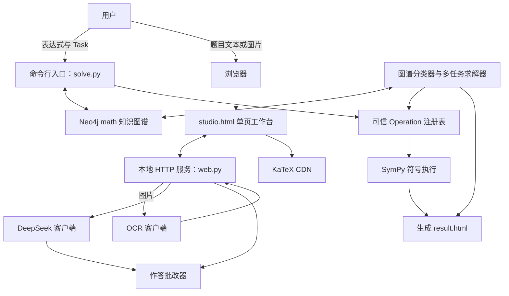

# 架构概述

本文档旨在帮助开发者与智能体快速、准确地理解 `k12-math` v0.1 的代码架构。文档描述的是截至 2026-08-20 仓库中已经存在的实现；尚未落地的设想统一放在“未来规划”中，不将其表述为现有能力。当组件边界、数据归属、外部集成、部署方式或安全假设发生变化时，应同步更新本文档。

## 1. 项目结构

该仓库是一个小型 Python 应用，提供两种入口：命令行解题程序和本地浏览器界面。v0.1 尚未封装为可安装的 Python 包，因此源码暂时采用扁平的 `src/` 目录结构。

```text
math-v0.1/
├── src/
│   ├── web.py                 # 本地 HTTP 服务与浏览器交互流程
│   ├── multi_solver.py        # 多小题、多任务编排
│   ├── classifier.py          # 受约束的 Task 与 Strategy 选择
│   ├── deepseek_client.py     # DeepSeek 结构化输出客户端
│   ├── ocr_client.py          # SiliconFlow 双 OCR 客户端
│   ├── problem.py             # 与传输层无关的数据契约
│   ├── operation_registry.py  # Operation ID 到 Python 处理器的可信映射
│   ├── solve.py               # Neo4j 加载、SymPy 执行与结果渲染
│   └── templates/
│       ├── studio.html        # 唯一的 Web 交互工作台
│       └── result.html        # 命令行静态解题报告模板
├── tests/
│   ├── test_classifier.py     # 任务路由测试
│   ├── test_multi_solver.py   # 复合题与多小题测试
│   ├── test_solve.py          # 符号执行与结果展示测试
│   ├── test_web.py            # 已确认题目完整性测试
│   └── test_ocr.py            # OCR 测试占位或辅助模块
├── docs/
│   └── DEVLOG.md              # 开发历史与发布记录
├── README.md                  # 安装、功能和使用说明
├── requirements.txt           # Python 运行时依赖声明
├── result.html                # 生成的或示例性的浏览器结果
├── .gitignore                 # 本地密钥、缓存与产物排除规则
└── ARCHITECTURE.md            # 本文档
```

项目的主要职责划分如下：

- `web.py` 负责传输层与用户交互；
- `classifier.py` 和 `multi_solver.py` 负责意图识别与任务编排；
- `solve.py` 和 `operation_registry.py` 负责可信的数学执行；
- `deepseek_client.py` 和 `ocr_client.py` 负责访问外部模型；
- `problem.py` 定义数据契约；
- `src/templates/studio.html` 负责 Web 输入与结果展示，`result.html` 负责命令行静态报告。

## 2. 高层系统架构图

系统同时保留命令行图谱求解与浏览器学习工作台。命令行路径使用 Neo4j 和 SymPy 生成经过验证的静态报告；工作台路径负责 OCR、AI 参考解答和作答批改，两条路径当前尚未统一为同一套验证链路。



关键边界如下：

1. 模型输出只用于信息提取或候选选择，不能充当不受限制的执行计划；
2. Neo4j 定义可用的 Task、Strategy 和 Operation 路径；
3. 只有在本地 Python 代码中注册过的 Operation ID 才能执行；
4. SymPy 负责校验和变换数学表达式；
5. HTML 模板只负责展示结果，不承载数学求解逻辑。

## 3. 核心组件

### 3.1. 前端

**名称：** 本地浏览器界面

**职责：** 通过单一响应式工作台接收文字或图片题目，选择自动、批改或求解模式，并在同一页面展示题干、步骤、评分和折叠的 OCR 原文。批改反馈区分通过、通过但建议补充、无法确认和未通过四种状态。

**技术栈：** HTML、CSS、浏览器原生 JavaScript、Fetch API，以及用于渲染 LaTeX 的 KaTeX。

**部署方式：** 由 Python `ThreadingHTTPServer` 在 `http://127.0.0.1:8000` 提供本地服务。生成的解题结果也可以直接以本地 `result.html` 文件打开。

**相关源码：** `src/templates/studio.html` 和 `src/web.py`。命令行静态报告另由 `src/templates/result.html` 和 `src/solve.py` 生成。

### 3.2. 后端服务

当前后端是由多个模块组成的单一本地进程，并非一组独立部署的微服务。以下“服务”名称表示逻辑组件，而不是物理部署单元。

#### 3.2.1. Web 入口服务

**名称：** 本地 Web 入口

**职责：** 提供单一工作台页面和 JSON 接口，接收题目文本或图片，限制上传体积，解析多部分表单，并协调 OCR、AI 参考解答与作答批改。

**技术栈：** Python 标准库 `http.server`、`email.parser` 和 JSON 编解码。

**部署方式：** 运行 `python src/web.py` 后，作为本地工作站上的进程内模块提供服务。

**源码：** `src/web.py`。

#### 3.2.2. 题目分类服务

**名称：** 受约束的 Task 与 Strategy 分类器

**职责：** 从 Neo4j 加载 Task 候选项和具备可执行条件的 Strategy 候选项。对于明确的对称轴或最值问题，优先通过本地关键词直接判定；对于存在歧义的情况，调用 DeepSeek，但只允许模型从给定的有限候选集合中选择一个标识符。缺少完整本地 Operation 注册路径的候选项会被排除。

**技术栈：** Python、通过 HTTP 执行的 Neo4j Cypher、DeepSeek 严格函数调用、数据类。

**部署方式：** 由浏览器流程和多任务求解流程调用的进程内模块。

**源码：** `src/classifier.py`、`src/deepseek_client.py` 和 `src/problem.py`。

#### 3.2.3. 多任务编排服务

**名称：** 复合题编排器

**职责：** 识别一道题中要求完成的全部任务，保持题目要求的先后顺序，尊重题目明确指定的解法，按照本地小题编号对多个表达式分组，执行知识图谱支持的任务，并在不阻塞可执行任务的前提下报告暂不支持的任务。

**技术栈：** Python、正则表达式、数据类、HTML 渲染。

**部署方式：** 进程内模块。

**源码：** `src/multi_solver.py`。

#### 3.2.4. 数学执行服务

**名称：** 知识图谱驱动的符号求解器

**职责：** 校验 Task 与 Strategy 之间的关系，从 Neo4j 加载有序 Operation，解析受限制的二次表达式，执行可信的本地处理器，验证符号等价性，生成人类可读的步骤并渲染答案。v0.1 已支持对称轴与最值 Task。

**技术栈：** Python、SymPy、Neo4j HTTP 事务端点、Cypher、数据类。

**部署方式：** 同时由 `solve.py` 命令行入口和浏览器流程以进程内方式调用。

**源码：** `src/solve.py`。

#### 3.2.5. Operation 注册表

**名称：** 可信 Operation 注册表

**职责：** 将 Neo4j 中存储的 Operation 标识符映射到明确注册的 Python 处理器。该边界用于防止模型输出或图数据库记录注入任意可执行代码。

**技术栈：** Python 装饰器与可调用对象。

**部署方式：** 由求解器初始化的进程内模块。

**源码：** `src/operation_registry.py`，以及 `src/solve.py` 中已注册的处理器。

#### 3.2.6. OCR 服务适配器

**名称：** SiliconFlow 双 OCR 适配器

**职责：** 校验图片媒体类型，将内存中的上传内容编码为 Base64，并行调用 PaddleOCR-VL 主识别模型与 DeepSeek-OCR 复核模型。两套文本共同进入步骤规范化；关键数学内容不一致或无法对齐时，步骤标记为无法确认，不能仅依据该 OCR 结果扣分。复核服务失败时保留主识别结果，并按单 OCR 降级处理。

**技术栈：** Python 标准库 HTTP 客户端、Base64、JSON、SiliconFlow REST API。

**部署方式：** 调用外部 HTTPS API 的进程内适配器。

**源码：** `src/ocr_client.py`。

#### 3.2.7. 作答批改服务

**名称：** 分步数学批改器

**职责：** 将 OCR 规范化步骤的推导连续性分为完整、可接受省略、无法确认和逻辑断裂，并将数学有效性分为有效、无效和未知。可接受的常规代数跳步正常得分；双 OCR 不一致或 OCR 无法确认时暂停该步最终评分；只有两套 OCR 在关键数学内容上一致后，确认的错误才由本地规则与 SymPy 继续校验，后续步骤独立判断。

**技术栈：** Python 数据类、枚举、正则表达式、SymPy，以及 DeepSeek 严格结构化输出。

**部署方式：** 由 Web 入口以进程内模块调用。

**源码：** `src/grader.py` 和 `src/deepseek_client.py`。

## 4. 数据存储

### 4.1. 数学知识图谱

**名称：** Neo4j `math` 数据库

**类型：** Neo4j 属性图，通过 HTTP 事务式 Cypher 端点访问。

**用途：** 存储 v0.1 使用的可执行课程结构。知识图谱决定存在哪些 Task、哪些 Strategy 可以解决对应 Task，以及一条 Strategy 路径由哪些有序 Operation 构成。图中还保存名称、描述、编号、祖先关系，以及渲染步骤时可能用到的条件信息。

**关键标签与关系：**

- `Task`；
- `Strategy`；
- `Operation`；
- Task 到 Strategy 的 `USES` 关系；
- Strategy 到 Operation 的路径关系及排序元数据；
- 可选的 Operation 条件和祖先元数据。

**数据归属：** 知识图谱负责声明式的策略结构，Python 代码负责可执行的处理器实现。只有当 `OperationRegistry.contains(operation_id)` 返回 `true` 时，图中的 Operation 才具备执行资格。

**连接方式：** 默认端点为 `http://localhost:7474/db/math/tx/commit`，默认用户名为 `neo4j`，密码通过交互式输入或环境变量 `NEO4J_PASSWORD` 提供。

### 4.2. 本地 HTML 产物

**名称：** 解题模板与生成结果

**类型：** 本地文件系统中的 HTML 文件。

**用途：** `src/templates/result.html` 是纳入版本控制的展示模板。执行解题后，系统会在指定输出路径创建或替换生成的 HTML 结果，并可使用默认浏览器打开。

**关键文件：**

- `src/templates/result.html`；
- 仓库根目录的 `result.html`，或用户通过 `--output` 指定的路径。

**限制：** 本地 HTML 只是展示产物，不是可查询的审计数据库。Web 运行诊断由下述 PostgreSQL 模式负责；当前仍不持久化用户账户、长期会话或知识图谱版本。

### 4.3. PostgreSQL 运行记录

**名称：** PostgreSQL `observability` 模式

**用途：** 按一次 Web 请求保存可查询的诊断链路，包括输入元数据、OCR 结果、DeepSeek 请求与响应、提示词及 JSON Schema 版本、规范化步骤、逐步批改结果、最终分数和失败信息。

**关键表：** `grading_runs`、`grading_trace_events`、`grading_step_evaluations` 和 `prompt_versions`。

**图片边界：** 数据库只保存原始文件名、媒体类型、文件大小和 SHA-256，不保存图片字节，不在文件系统中另行备份。同一图片可对应多次独立运行记录。

**故障边界：** `src/grading_trace.py` 采用尽力写入策略。未配置 PostgreSQL 或写入失败时只输出警告，不改变 OCR、求解和批改接口的原有结果。

**初始化：** 依次使用 `db/migrations/001_create_observability_tables.sql` 创建模式、表、约束和索引，再使用 `db/migrations/002_add_dual_ocr_evidence.sql` 增加双 OCR 一致性证据字段；连接信息来自 `POSTGRES_DSN`，或 `POSTGRES_HOST`、`POSTGRES_PORT`、`POSTGRES_DB`、`POSTGRES_USER`、`POSTGRES_PASSWORD`。

## 5. 外部集成与 API

**服务名称：** DeepSeek Chat Completions

**用途：** 从题目文本中提取一个或多个 SymPy 表达式；当本地确定性路由无法充分判断时，从有限候选集合中选择 Task 或 Strategy 标识符；对 OCR 步骤进行连续性和数学有效性分类；生成 AI 参考解答。

**集成方式：** 向 `https://api.deepseek.com/beta/chat/completions` 发送 HTTPS JSON 请求，使用严格函数调用模式和有限标识符枚举。凭据来自 `DEEPSEEK_API_KEY`。

**服务名称：** SiliconFlow 双 OCR

**用途：** 将 PNG、JPEG 或 WEBP 格式的题目图片转换为两份独立文本，以便交叉核验公式、变量和运算符。

**集成方式：** 并行使用 `PaddlePaddle/PaddleOCR-VL-1.5` 和 `deepseek-ai/DeepSeek-OCR` 模型，向 `https://api.siliconflow.cn/v1/chat/completions` 发送 HTTPS JSON 请求。凭据来自 `SILICONFLOW_API_KEY`。

**服务名称：** Neo4j 事务式 HTTP API

**用途：** 从本地 `math` 知识图谱查询 Task、Strategy、Operation、描述、条件和路径元数据。

**集成方式：** 使用 HTTP Basic 身份认证，将 Cypher 语句发送到 Neo4j 事务端点。

**服务名称：** MathJax CDN

**用途：** 在生成的结果页面中渲染 LaTeX 数学公式。

**集成方式：** 由 HTML 结果模板引用外部 JavaScript，并在浏览器中加载。离线时文本解题结果仍可显示，但公式渲染可能不可用。

## 6. 部署与基础设施

**云服务提供商：** 无。v0.1 是本地工作站原型。

**主要运行依赖：**

- 本地 Python 运行时；
- 本地 Neo4j `math` 数据库，通常通过 Docker 容器提供；
- 可选的本地 PostgreSQL `demo` 数据库，用于保存运行诊断记录；
- DeepSeek 和 SiliconFlow 外部 API；
- 本地默认浏览器；
- MathJax CDN。

**运行时拓扑：**

```text
Windows 工作站
├── Python 进程
│   ├── 命令行求解器，或
│   └── 监听 127.0.0.1:8000 的本地 HTTP 服务
├── 监听 localhost:7474 的 Neo4j Docker 容器
├── 监听 localhost:5432 的 PostgreSQL Docker 容器（可选）
└── 浏览器
    └── 访问 MathJax CDN
```

**CI/CD 流水线：** v0.1 尚未配置仓库级 CI/CD 工作流。发布或合并变更前，需要手动执行测试。

**监控与日志：** 控制台继续输出 HTTP 请求和错误；配置 PostgreSQL 后，可按运行记录查询 OCR、模型调用、提示词版本、逐步判定和最终响应。当前仍没有指标采集、分布式追踪和告警系统。

**打包方式：** 当前版本不包含 Dockerfile、Compose 文件、Python 包元数据、依赖锁定文件、发布制品自动化或生产部署配置。

## 7. 安全性考虑

**身份认证：** 应用本身没有用户身份认证。Neo4j 使用 HTTP Basic 认证，外部模型服务使用 API Bearer Key。

**权限控制：** 应用没有 RBAC 或多用户权限模型。本地进程继承操作系统用户的文件权限，以及所配置 Neo4j 账户的知识图谱权限。

**数据加密：**

- DeepSeek 与 SiliconFlow 请求使用 HTTPS；
- 默认本地浏览器服务在回环地址上使用未加密 HTTP；
- 默认 Neo4j 端点在本机使用未加密 HTTP；
- 生成的 HTML 以明文本地文件形式保存。

**现有安全机制与实践：**

- API 凭据、Neo4j 密码和 PostgreSQL 密码从环境变量或交互式密码输入读取，不硬编码到源码；
- 上传图片本体不写入 PostgreSQL，只保存非内容元数据与 SHA-256；
- 表达式在交给 SymPy 解析前必须通过受限字符集检查；
- Task 和 Strategy 只能从 Neo4j 返回的有限标识符集合中选择；
- 只有在本地注册的 Operation 处理器能够执行；
- 上传图片仅支持 PNG、JPEG 和 WEBP；
- 浏览器上传大小上限为 10 MB；
- 模板使用用户题目文本或渲染内容时执行 HTML 转义；
- OCR 文本必须经过用户确认或修正后才能进入求解流程。

**已知安全缺口：**

- 缺少统一且适合公开返回的错误模型；
- 缺少限流和请求身份认证；
- 当前未实现 CSRF 防护，其前提是假设服务只监听回环地址；
- PostgreSQL 诊断记录尚未配置自动清理、脱敏、访问分级或保留期限；
- 缺少依赖漏洞扫描和密钥扫描工作流；
- 本地 Neo4j 与本地浏览器流量未启用 TLS；
- 除受限解析器和可信 Operation 注册表外，没有额外执行沙箱；
- 发送给外部服务的数据隐私取决于实际传输内容和服务商条款。

在补齐身份认证、请求防护、安全错误处理和网络威胁控制之前，本地 HTTP 服务必须继续只绑定回环地址。

## 8. 开发与测试环境

**本地环境搭建：**

1. 安装 Python 依赖：

   ```powershell
   python -m pip install -r requirements.txt
   ```

2. 启动或连接 Neo4j 实例，确保其中存在 `math` 数据库，以及所需的 Task、Strategy 和 Operation 记录。

3. 运行命令行入口：

   ```powershell
   python src/solve.py --expression "x**2/2 - 5*x + 1"
   ```

4. 如需使用浏览器和图片识别流程，配置外部服务凭据：

   ```powershell
   $env:DEEPSEEK_API_KEY = "..."
   $env:SILICONFLOW_API_KEY = "..."
   python src/web.py
   ```

5. 在浏览器中打开 `http://127.0.0.1:8000`。

**测试框架：** Python 标准库 `unittest`，配合 Mock 和相互隔离的符号计算测试。

**测试命令：**

```powershell
$env:PYTHONPATH = "src"
$env:PYTHONDONTWRITEBYTECODE = "1"
python -m unittest discover -s tests -v
```

截至 2026-08-20，共发现 54 项测试，现已全部通过。测试范围包括：

- 确定性 Task 路由和模型兜底路由；
- 多任务识别与不支持任务的结果输出；
- 显式 Strategy 选择；
- 多表达式分组；
- 对称轴和最值的符号求解；
- 仿射代换；
- 展示结果规范化；
- 已确认题目的完整性和本地小题编号；
- 单页工作台模板与上传表单契约；
- 合理代数跳步、真实逻辑断裂和 OCR 无法确认状态；
- 双 OCR 并行调用、复核失败降级、分歧不扣分和一致错误扣分；
- PostgreSQL 运行记录、提示词版本复用和图片元数据边界。

**代码质量工具：** v0.1 尚未配置格式化工具、代码检查器、静态类型检查器、覆盖率门禁、pre-commit 或自动化安全扫描器。

**依赖管理：** `requirements.txt` 声明了 `sympy>=1.13`、`python-dotenv>=1.0` 和 `psycopg[binary]>=3.2`。外部 HTTP 集成使用 Python 标准库，依赖版本尚未完全锁定。

## 9. 未来规划

以下内容属于计划或建议的演进方向，不代表 v0.1 已经具备相应能力：

1. 新增独立的、由知识图谱驱动的顶点 Task，并引入可复用的已验证事实；
2. 以明确的配置错误、上游服务错误、知识图谱错误和执行错误类型替代通用异常；
3. 为接入“伴学”系统定义稳定、结构化的求解器契约；
4. 建立可复现的知识图谱迁移机制，避免依赖未记录的手工改图；
5. 基于临时 Neo4j 测试数据库补充集成测试；
6. 增加覆盖测试、格式检查、类型检查、依赖扫描和密钥扫描的 CI；
7. 将源码封装为可安装的 Python 项目，并锁定依赖解析结果；
8. 将生成产物与版本控制中的模板分离，同时记录解题过程的来源信息；
9. 增加结构化日志、请求 ID、模型与 Prompt 版本、耗时以及安全错误码；
10. 只有在身份认证、限流和安全部署控制完善后，再引入生产级 API 边界；
11. 接入“伴学”内容管线中的教材出处和课程证据；
12. 扩展支持的数学主题时，继续将可信 Operation 注册表作为执行边界。

在实际出现扩缩容或团队所有权边界之前，项目应继续保持模块化求解器形态。微服务和 Kubernetes 不是当前阶段的目标。

## 10. 项目标识

**项目名称：** k12-math

**架构版本：** v0.1

**代码仓库：** https://github.com/starswei/k12-math

**主分支：** `main`

**主要负责人：** starswei / 独立开发者

**项目定位：** 基于知识图谱、结果可验证的 K12 数学求解器原型，也是未来“伴学”系统的数学解题模块。

**最后更新日期：** 2026-08-20

## 11. 术语与缩略语

**Agent（智能体）：** 结合模型、工具、状态和策略完成多步骤任务的软件组件。

**Candidate（候选项）：** 从 Neo4j 加载、可供受约束选择的有限 Task 或 Strategy 选项。

**Cypher：** Neo4j 使用的图查询语言。

**DeepSeek：** 本项目用于结构化信息提取和受约束选择的外部模型服务。

**HLD（High-Level Design）：** 高层设计。

**K12：** 从学前教育到高中阶段的基础教育范围。

**MathJax：** 用于在浏览器中渲染 LaTeX 数学公式的 JavaScript 库。

**Neo4j：** 存储 Task、Strategy 和 Operation 声明式关系的属性图数据库。

**OCR（Optical Character Recognition）：** 光学字符识别。

**Operation（操作）：** 在 Neo4j 中以 ID 声明、由可信 Python 处理器实现的细粒度数学变换或读取步骤。

**Operation Registry（操作注册表）：** 将知识图谱中的 Operation ID 映射到可执行 Python 函数的本地白名单。

**Problem（问题）：** 用户确认后的自然语言题目，以及经过规范化的 SymPy 表达式。

**SiliconFlow：** 本项目访问 DeepSeek-OCR 所使用的外部 API 服务商。

**Strategy（策略）：** 由多个 Operation 构成、用于解决某个 Task 的有序知识图谱路径。

**SymPy：** 用于解析、变换和验证表达式的 Python 符号数学库。

**Task（任务）：** 数学求解目标，例如求二次函数的对称轴或最值。

**Trusted Execution（可信执行）：** 模型或知识图谱的声明式输出不得执行任意代码，只有本地注册的处理器可以运行。
